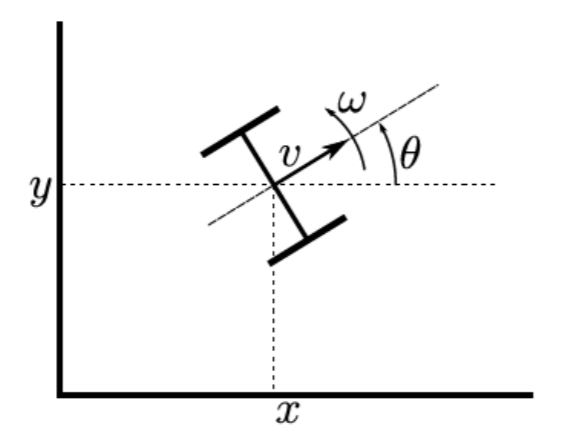

# NonHolonomicAstar

A* is a well-known algorithm widely used for solving graph-based search and path-finding problems.
While the traditional algorithm is suited for graph search, it does not seem to be well suited for actual
planning because it requires a discretization of the environment and cannot really take into account
the nonholonomic constraints governing a mobile robot’s motion.

Though the traditional path-planning approach of discretizing the environment space and using the
A* algorithm may not be suited, different other approaches can be devised which utilise the A*
technique and also satisfy the nonholonomic constraints governing the robot’s motion. These
approaches may promise satisfactory performance. However, this area remains relatively unexplored.

## Objective
The objective of the present study is to explore a variation of the traditional path-planning approach
which involves discretization of not the environment, but the control inputs to solve path planning
problem for a (2,0) robot. An expected outcome is that the discretization happens in lower dimension
than when done on the environment, and that the generated path complies with the nonholonomic
constraints. 

## Robot architecture 

The (2,0) mobile robot is a two degrees-of-freedom system which contains two independently actuated fixed type wheels (left and right). The robot is controlled via setting the angular velocities of the left and right wheels which determine the overall behaviour of the robot.

Non-holonomic constraints – Constraints which can’t be expressed solely as functions of the
coordinate parameters of the system and time elapsed are called non-holonomic constraints. For
mobile robots, these constraints dictate what types of motions are feasible. In case of a (2,0) type
mobile robot, at any instant, the non-holonomic constraints render the robot capable of:
- Moving in a straight line along the local axis 𝑿 of the mobile frame at linear velocity 𝒗
- Rotating about its centre along the 𝒁 axis at angular velocity 𝝎
- A combination of both

## Code Architecture

Note: always make a "results" folder inside the "mazes" folder. 
